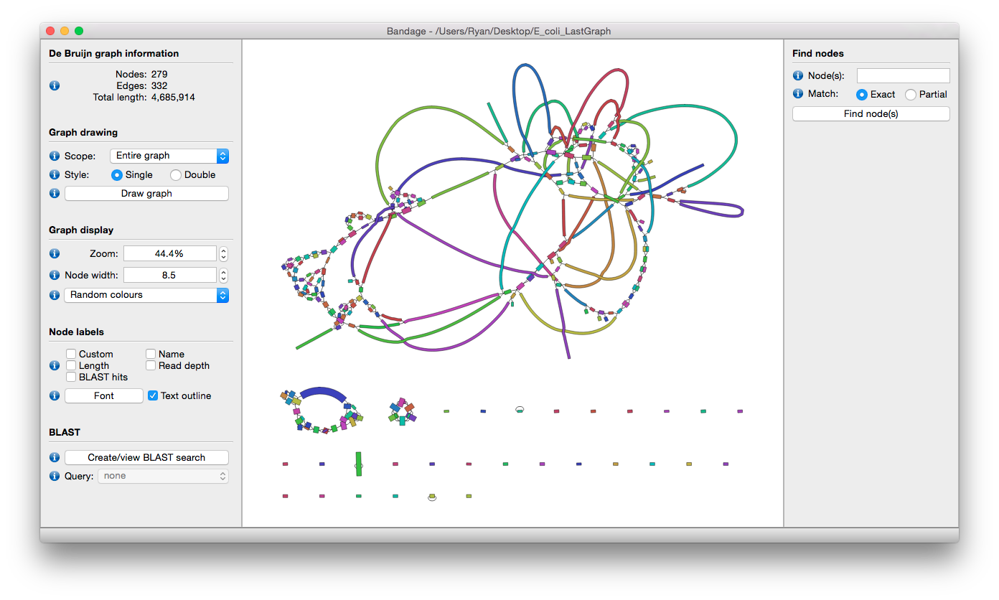

## Graphical Fragment Assembly GFA 2.0

Shaun Jackman [\@sjackman][]

2017-01-18

<https://sjackman.ca/gfa2-slides>

[][cc-by]

[\@sjackman]: http://twitter.com/sjackman
[cc-by]: http://creativecommons.org/licenses/by/4.0/

## Shaun Jackman

| [BC Cancer Agency Genome Sciences Centre][]
| Vancouver, Canada
| [\@sjackman][] | [github.com/sjackman][] | [sjackman.ca][]

[BC Cancer Agency Genome Sciences Centre]: http://bcgsc.ca
[github.com/sjackman]: https://github.com/sjackman
[sjackman.ca]: http://sjackman.ca

Common file format
================================================================================

## Common file format

+ Interoperable modular tools
+ Deduplication of effort
+ Data visualization

## Alignment

+ Alignment and variant calling is a pipeline of two stages
+ Alignment reads FASTQ produces SAM/BAM
+ Variant calling reads SAM/BAM produces VCF

## Benefits

Things we take for granted

+ Mix and match aligners and variant callers
+ Support tools (samtools) shared by everyone
+ Visualization tools (IGV) shared by everyone
+ Troubleshooting intermediate stages
+ All possible because of SAM/BAM

## Assembly

+ Assembly is a pipeline \
  Overlap, Layout, Consensus
+ Common input file format (FASTQ)
+ Common output file format (FASTA)
+ No common intermediate file format

## Deduplication of effort

+ Developing a new variant caller doesn't require developing a new aligner
+ Developing a new assembler shouldn't require developing a new read overlap tool

## GFA 1

+ Started as a blog post by Heng Li
+ Sequence overlap graph
+ Vertices (segments) are contigs
+ Edges (links) are their overlaps
+ Tab separated format
+ Extensible (optional tagged fields)

## Implementations

+ [ABySS](https://github.com/bcgsc/abyss)
+ [Bandage](https://rrwick.github.io/Bandage/)
+ [bcalm2](https://github.com/GATB/bcalm)
+ [bfgraph](https://github.com/pmelsted/bfgraph)
+ [Canu](https://github.com/marbl/canu/)
+ [fermi mag2gfa](https://github.com/lh3/mag2gfa)
+ [gfakluge](https://github.com/edawson/gfakluge)
+ [gfalint](https://github.com/sjackman/gfalint)
+ [gfatools](https://github.com/lh3/gfatools)
+ [lmrodriguezr/gfa](https://github.com/lmrodriguezr/gfa)
+ [McCortex](https://github.com/mcveanlab/mccortex)
+ [miniasm](https://github.com/lh3/miniasm)
+ [RGFA](https://github.com/ggonnella/RGFA)
+ [vg](https://github.com/ekg/vg)
+ [TwoPaCo](https://github.com/medvedevgroup/TwoPaCo)

----------------------------------------

## Limitations

+ Intended for
    + Short read assembly
    + Contig overlap graph (not reads)
+ CIGAR unwieldy for long read alignment
+ Links represent only dove-tail overlaps

## GFA 2

+ Short and long read assembly
+ Read overlap graph or contig overlap graph
+ Arbitrary alignments (not just dovetail)
    + Correcting reads
	+ Identifying repeats
+ CIGAR or compact trace alignments
+ Gap edges and paths for scaffolding

## Exciting Possibilities

+ Mixing components of assembly pipelines
+ Visualization of intermediate results \
  aids troubleshooting
+ Align reads to a pan-genome
+ Graph-aware gene annotation
+ Innovation in modular assembly tools
	+ Identify heterozygous contigs
    + Identify misassembled contigs
+ Modular scaffolding tools
    + One tool produces gap edges
	+ Another tool creates scaffolds

## xkcd: Standards

fin
================================================================================

## Shaun Jackman

| [BC Cancer Agency Genome Sciences Centre][]
| Vancouver, Canada
| [\@sjackman][] | [github.com/sjackman][] | [sjackman.ca][]

**GFA Specification** \
<https://github.com/GFA-spec/GFA-spec>

**Slides** \
<https://sjackman.ca/gfa2-slides>

**Markdown source code** \
<https://github.com/sjackman/gfa2-slides>
